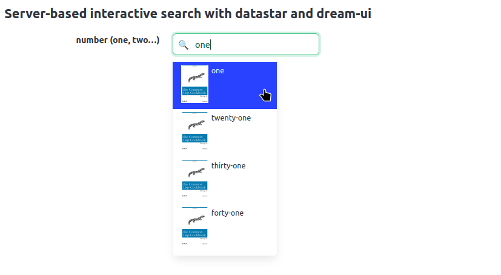

Trying out:

# DataStar

with https://github.com/fsmunoz/datastar-cl

## minimal example

We get a minimal example going. Type something, it's displayed below.

## Server-based autocomplete

We use dream-ui's combobox (see below) with datastar.

aka: **a server-based autocomplete/select2-like interactive search with
no JavaScript at all**.

The component is fine. We can style each result (include a small image
etc), following [Bulma's dropdown rules](https://bulma.io/documentation/components/dropdown/#dropdown-content).

The keyboard selection is OK when you don't mess up the tab index ;) (a number)



in `datastar-dream-ui.lisp`.

We also try the markup library: it's good, it even has an Emacs plugin
to have HTML highlighting inside our Lisp code. One caveat:

- we can't write a non-closing HTML snippet (or only the closing part).


# Dream-ui's server-based combobox search with HTMX

It's an autocomplete/select2 like component that we can update with
HTMX. No JavaScript required.

https://github.com/yawaramin/dream-html-ui (look, 1 single star)


# Fluxion reactive web framework

https://github.com/parenworks/Fluxion

The examples work.

They work with Clack and Woo (libev). The snippet to use Hunchentoot does not work. See issue #2.

https://github.com/parenworks/Fluxion/issues/2

```lisp
(make-instance 'fluxion-app :server :hunchentoot)
=>
#<FLUXION-APP :5000 hunchentoot 0 sessions {120647DB73}>

(start #<FLUXION-APP :5000 hunchentoot 0 sessions {120647DB73}> (make-router))
=>
Clack.utils error: hunchentoot is unknown handler
```


# Typeahead, datalist, server-based search input.

The browser's `datalist` is too minimal and useless.

I use `select2` with some not-so-awful, but some JS.

- dream-ui.lisp, testing this project seen on HTMX Discord: https://github.com/yawaramin/dream-html-ui/
  - works fine. We can update the options with HTMX and even style them.
  - that's huge!


# Gantt charts

- https://github.com/frappe/gantt


=> OK, no "add task" button ?

- https://dhtmlx.com/docs/products/dhtmlxGantt/open-source/


=> very functional, open-core. Grouping tasks only in PRO version :/

## to test

- https://gantt-online.com/
  - more of a self-contained app.

- server-based combobox search (on datalist, enhanced): https://yawaramin.github.io/dream-html-ui/dh-combobox.html
  - https://github.com/yawaramin/dream-html-ui/

> you can use htmx to update the datalist so it's effectively server-based active search
> the key was to make the combo box watch for changes in the datalist using MutationObserver
> it looks and works exactly the same way on all major browsers, plus instead of using a datalist it can also render more complex components as menu items


# Calendars?

- https://github.com/williamtroup/Calendar.js => at last. Full featured. In `cal-js.html`.
- https://github.com/nhn/tui.calendar Wow! Full featured?!
- https://schedule-x.dev/docs/calendar/plugins/interactive-event-modal
  - create/edit events in a modale is a PRO feature.
- https://fullcalendar.io/docs/external-dragging how to create events?

# Use

This is only web stuff right? Here's a Lisp tip, a CLI one-liner to
launch a local webserver:

    ciel - simplehttpserver
